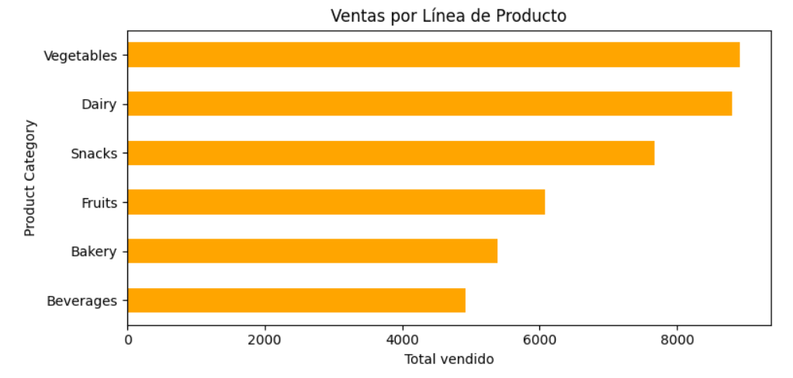

# 🛍️ Análisis de Ventas - Supermarket Dataset

Este proyecto analiza ventas en supermercados usando Python y pandas en Kaggle. Explora tendencias por ciudad, género, tipo de producto y método de pago.

## 🔧 Herramientas utilizadas
- Python (pandas, matplotlib, seaborn)
- Kaggle (notebook)
- GitHub (documentación)

## 📊 Visualizaciones

## 📁 Estructura
- `data/`: dataset original
- `notebooks/`: notebook de análisis
- `images/`: capturas de visualizaciones